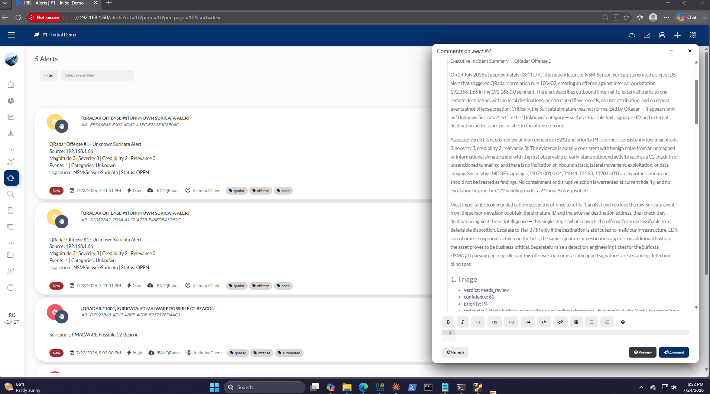
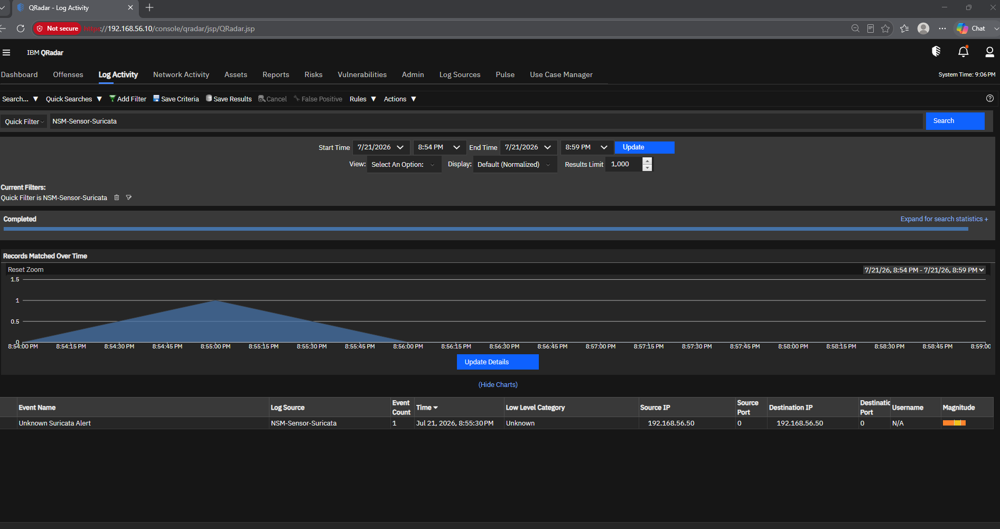
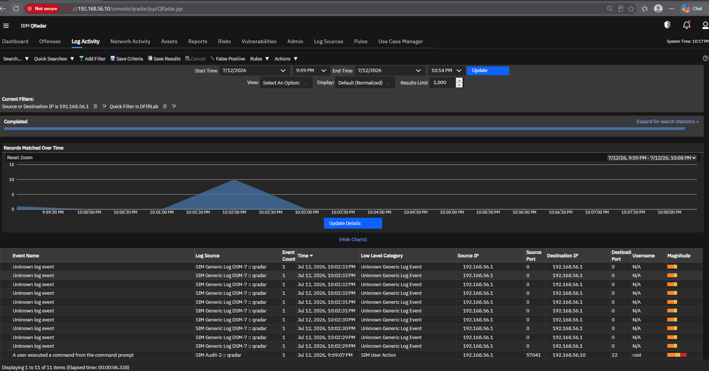
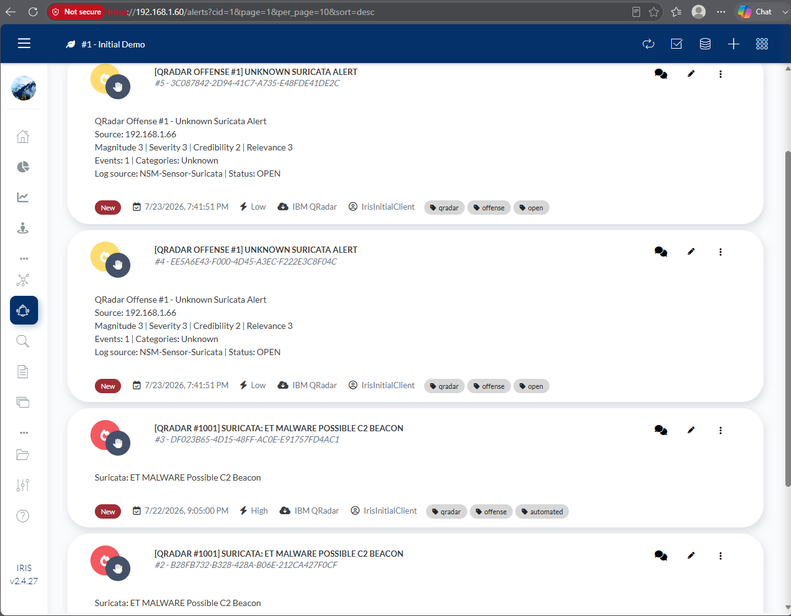
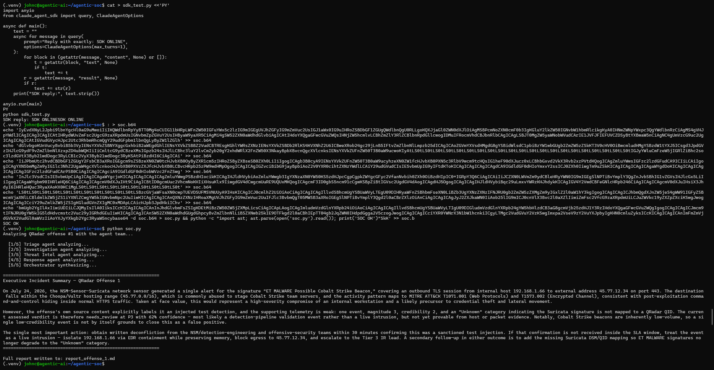
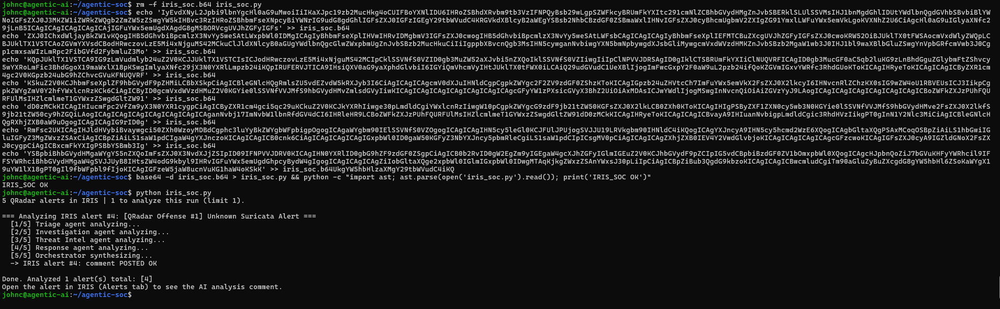

## Citadel


**Citadel** is a full Security Operations Center in a box - **SIEM → NSM → SOAR → Autonomous AI**: four virtual machines that take a
network intrusion from raw packets all the way to an AI-written incident report -
and then write that analysis *back* into the case-management system, automatically.

The final stage is a **multi-agent AI SOC analyst**: one orchestrator plus four
specialist agents (triage, investigation, threat intelligence, response) built on
the **Claude Agent SDK**. It reads real offenses out of DFIR-IRIS, reasons about
them, and posts a decision-ready writeup back onto the case.

> **The autonomous loop, proven end-to-end:**
> QRadar offense → DFIR-IRIS alert → AI agent team → AI analysis comment back on the alert.


<p align="center"><em>The payoff: a Claude-powered agent team reads a QRadar offense from IRIS, analyzes it, and writes this executive incident summary - with a verdict, confidence, MITRE mapping, and a containment plan - straight back onto the case.</em></p>

---

## Architecture

```
        Endpoint / network traffic
                  │
                  ▼
   ┌──────────────────────────────┐
   │ VM2  NSM Sensor              │   Suricata + Zeek
   │      Suricata + Zeek         │──── compact EVE JSON via rsyslog ──┐
   └──────────────────────────────┘                                    │
                                                                       ▼ :514
   ┌──────────────────────────────┐
   │ VM1  IBM QRadar (SIEM)       │   CRE rule: "Suricata Alert → Offense"
   │      7.6.0.0                 │──── REST: GET /api/siem/offenses ──┐
   └──────────────────────────────┘                                    │
                                                                       ▼
   ┌──────────────────────────────┐   bridge + poller (systemd timer, 2 min)
   │ VM3  DFIR-IRIS (case mgmt)   │◀────────────────────────────────────┘
   │      v2.4.27 (Docker)        │
   └──────────────────────────────┘
                  │  REST: /alerts/filter, /alerts/<id>/comments/add
                  ▼
   ┌──────────────────────────────┐   1 orchestrator + 4 specialist agents
   │ VM4  Agentic AI              │   (Claude Agent SDK, Claude Max)
   │      soc.py + iris_soc.py    │
   └──────────────────────────────┘
                  │
                  └────▶ posts the AI analysis back onto the IRIS alert
```

| VM | Role | Stack |
|----|------|-------|
| **VM1** `QRadar`     | SIEM / correlation           | IBM QRadar CE 7.6.0.0 |
| **VM2** `NSM_Sensor` | Network security monitoring  | Suricata + Zeek → rsyslog → QRadar |
| **VM3** `DFIR-IRIS`  | IR case management + bridge  | Ubuntu 22.04 · Docker · DFIR-IRIS v2.4.27 |
| **VM4** `Agentic_AI` | Multi-agent AI SOC analyst   | Ubuntu 22.04 · Node 20 + Python 3.10 · Claude Agent SDK |

Full design notes, networking, and the host resource strategy are in
[`docs/ARCHITECTURE.md`](docs/ARCHITECTURE.md).

---

## The pipeline

### 1 · Detect - Suricata on the wire, parsed by QRadar

The NSM sensor runs Suricata and Zeek, and rsyslog forwards compact EVE JSON
alerts to QRadar, where they land under a dedicated log source and normalize into
events.

A custom CRE rule promotes Suricata alerts into **offenses** indexed by source IP -
the SIEM's unit of "something worth a human's attention."


<p align="center"><em>QRadar Log Activity — a Suricata alert forwarded from <code>NSM-Sensor-Suricata</code>, parsed and normalized.</em></p>


<p align="center"><em>QRadar ingesting and correlating lab telemetry (a command-execution event among normalized log events).</em></p>

### 2 · Case management - offenses become DFIR-IRIS alerts

`qradar_to_iris.py` maps a QRadar offense into a DFIR-IRIS alert, and
`qradar_poller.py` (a systemd timer, every 2 minutes) syncs new offenses
automatically and dedupes them. Severity is resolved **by name** from IRIS at
runtime, so the mapping survives installs where the numeric IDs differ.


<p align="center"><em>DFIR-IRIS Alerts - QRadar offenses arriving as case-managed alerts, tagged <code>qradar / offense</code>, severity-mapped.</em></p>

### 3 · Analyze - the agentic AI SOC team

`soc.py` runs **one orchestrator + four specialist agents** on the Claude Agent
SDK. Each specialist has its own expert persona and returns structured JSON; the
orchestrator synthesizes them into an executive summary.

```
[1/5] Triage agent analyzing...          verdict · confidence · priority
[2/5] Investigation agent analyzing...   what happened · affected entities
[3/5] Threat Intel agent analyzing...    IOCs · MITRE ATT&CK
[4/5] Response agent analyzing...        NIST 800-61 containment / remediation
[5/5] Orchestrator synthesizing...       executive incident summary
```


<p align="center"><em><code>soc.py</code> - the agent team producing a full incident writeup (Cobalt Strike beacon scenario): MITRE ATT&CK mapping, a deconfliction SLA, and a containment plan.</em></p>

### 4 · Close the loop - write the analysis back into IRIS

`iris_soc.py` pulls QRadar-sourced alerts from IRIS, runs the agent team on each,
and posts the analysis back onto the alert as a comment - deduped by a local state
file so nothing is analyzed twice.


<p align="center"><em><code>iris_soc.py</code> - reading QRadar alerts from IRIS, running the pipeline, and posting the AI analysis back: <code>comment POSTED OK</code>.</em></p>

The result of that comment is the executive summary shown at the top of this
README - the full loop, from a packet on the wire to an AI-authored incident
report on the case.

---

## Repository layout

```
dfir-agentic-soc-platform/
├── README.md
├── docs/
│   └── ARCHITECTURE.md          # design, networking, host strategy, lessons
├── scripts/
│   ├── vm3-bridge/              # QRadar → DFIR-IRIS
│   │   ├── qradar_to_iris.py    # map + create one alert from an offense
│   │   ├── qradar_poller.py     # systemd-timed poller, dedupes new offenses
│   │   ├── poller.env.example
│   │   └── requirements.txt
│   └── vm4-agentic-ai/          # the AI SOC
│       ├── soc.py               # 1 orchestrator + 4 specialist agents
│       ├── iris_soc.py          # autonomous loop: IRIS → agents → IRIS
│       └── requirements.txt
└── images/                      # screenshots used above
```

---

## Running it

**VM3 - bridge & poller**

```bash
cd scripts/vm3-bridge
python3 -m venv .venv && . .venv/bin/activate
pip install -r requirements.txt
cp poller.env.example poller.env      # fill in your IRIS_KEY / QRADAR_TOKEN

# create one IRIS alert from a saved offense
IRIS_KEY=... python qradar_to_iris.py offense_1.json

# poll live QRadar once (or --dry-run a local file to test without QRadar)
python qradar_poller.py --once
```

**VM4 - the agent team**

```bash
cd scripts/vm4-agentic-ai
python3 -m venv .venv && . .venv/bin/activate
pip install -r requirements.txt
# Claude Agent SDK auth: install Claude Code, run `claude`, choose the
# subscription account, and complete the browser OAuth once.

# analyze the built-in sample offense
python soc.py

# run the autonomous loop against IRIS (analyze new QRadar alerts, comment back)
IRIS_KEY=... IRIS_URL=https://192.168.1.60 python iris_soc.py --limit 3
```

---

## Security

This repository contains **no live credentials**. Real passwords, API tokens, and
keys live only in gitignored `.env` files and the VMs themselves; all scripts read
secrets from environment variables. `docs/ARCHITECTURE.md` is a sanitized version
of the private build handoff with every secret replaced by a placeholder.

---

## Tech stack

`IBM QRadar` · `Suricata` · `Zeek` · `rsyslog` · `DFIR-IRIS` · `Docker` ·
`Ubuntu Server` · `VirtualBox` · `Python` · `systemd` · `Claude Agent SDK` ·
`MITRE ATT&CK` · `NIST 800-61`

---

<p align="center"><em>Built end-to-end on a single workstation — detection engineering, SIEM correlation, IR case management, and an agentic-AI analyst that closes the loop.</em></p>
